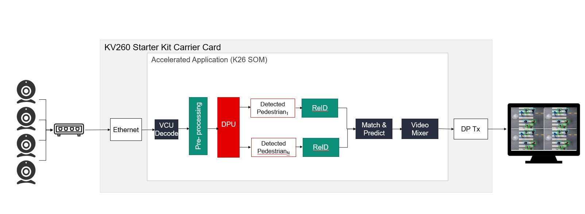

<h1 align="center">AIBOX-REID APPLICATION </h1>

## Introduction
This repository contains source code of Kria SOM AIBox-ReID accelerated application. 

The AI Box with ReID accelerated application performs distributed, scalable, multi-stream tracking and Re-Identification. The application leverages machine learning for pedestrian tracking and decoding multiple camera streams and performs pedestrian detection and tracking across camera feeds. Common applications include smart cities, retail analytics, and video analytics.

 <div align="center">
  
</div>

For more details refer [AIBox ReID Landing Page](https://xilinx.github.io/kria-apps-docs/kv260/2022.1/build/html/docs/aibox-reid/aibox_landing.html)

## How to Cross Compile

If you want to cross compile the source in Linux PC machine, follow these steps, otherwise skip this section.

1. Refer to the [K260 SOM Starter Kit Tutorial](https://xilinx.github.io/kria-apps-docs/kv260/2021.1/build/html/docs/build_petalinux.html#build-the-sdk) to build the cross-compilation SDK, and install it to the path you choose or default. Suppose it's SDKPATH.

2. Run "./build.sh ${SDKPATH}" in the source code folder of current application, to build the application. <a name="build-app"></a>

3. The build process in [2](#build-app) will produce a rpm package aibox-reid-1.0.1-1.aarch64.rpm under build/, upload to the board, and run "rpm -ivh --force ./aibox-reid-1.0.1-1.aarch64.rpm" to update install.


## Setting up the Board and Application Deployment
A step by step tutorial and details on how to setup the board and run this application is given in the [AIBox ReID Documentation](https://xilinx.github.io/kria-apps-docs/kv260/2022.1/build/html/docs/aibox-reid/docs/app_deployment_aib.html). Please visit the documentation page for more details.

## Files structure

* The application is installed as:

  * Binary File Directory: /opt/xilinx/bin

      | filename | description |
      |----------|-------------|
      |aibox-reid| main app|

  * Configuration file directory: /opt/xilinx/share/vvas/aibox-reid

      | filename | description |
      |-|-|
      |ped_pp.json       |           Config of preprocess for refinedet.
      | refinedet.json   |           Config of refinedet.
      | crop.json        |           Config of cropping for reid.
      | reid.json        |           Config of reid.
      | draw_reid.json   |           Config of final results drawing.

  * Configuration File Directory: /opt/xilinx/kv260-aibox-reid/share/vitis_ai_library/models
    
      The model files integrated in the application use the B3136 DPU configuration.

      | foldername | description |
      |----------|-------------|
      |personreid-res18_pt | Model files for reid|
      |refinedet_pruned_0_96| Model files for refinedet| 	  

   * Jupyter Notebook Directory: /opt/xilinx/share/notebooks/aibox-reid

     | filename | description |
     |----------|-------------|
     |aibox-reid.ipynb | Jupyter notebook file for aibox-reid.|

<p align="center"><sup>Copyright&copy; 2022 Xilinx</sup></p>


## License

````
Copyright 2022 Xilinx Inc.
Licensed under the Apache License, Version 2.0 (the "License");
you may not use this file except in compliance with the License.
You may obtain a copy of the License at

    http://www.apache.org/licenses/LICENSE-2.0

Unless required by applicable law or agreed to in writing, software
distributed under the License is distributed on an "AS IS" BASIS,
WITHOUT WARRANTIES OR CONDITIONS OF ANY KIND, either express or implied.
See the License for the specific language governing permissions and
limitations under the License.
````